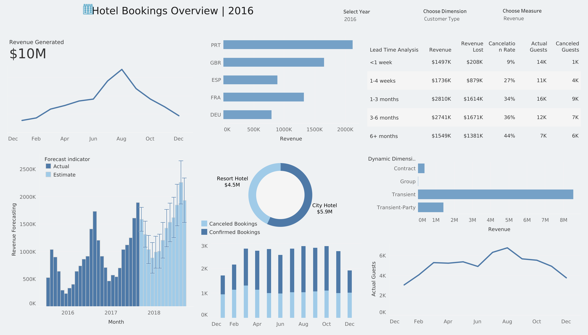

📊 Hotel Booking Analytics Dashboard
This project provides a deep-dive analysis of hotel booking data to uncover key business insights around revenue, guest behavior, cancellations, and forecasting.

🧾 Overview
The Hotel Bookings Overview Dashboard (2016) is a Tableau visualization project designed to help hotel management identify key trends and pain points across guest bookings. The analysis leverages real-world booking data (~120K rows) to uncover actionable insights.

  

Key Dashboards & Insights

1. Revenue Trend & Forecasting :
$10M in revenue generated in 2016.
Peak revenue observed in August, indicating strong seasonal trends.
Forecasting chart shows estimated vs. actual revenues with increasing trends into 2018.

2. Booking Lead Time Impact :
Longer lead times (3-6 months, 6+ months) are linked to higher cancellation rates (36%–44%).
Shorter lead times (<1 week) show lowest cancellation rate (9%) and minimal revenue loss.

3. Top Source Countries :
Majority of bookings and revenue come from:
Portugal (PRT) nearly ~$2M,
UK (GBR) and France (FRA) are  Significant contributors.

4. Hotel Type Breakdown :
City Hotel outperforms Resort Hotel, generating $5.9M vs. $4.5M in revenue.
Booking preferences and guest segments vary by hotel type.

5. Dynamic Guest & Booking Segmentation :
The dashboard includes a dynamic parameter selector that lets users switch between multiple segmentation dimensions, such as:
Customer Type (e.g., Transient, Group, Contract)
Meal Type
Reserved Room Type
Distribution Channel
This helps to compare performance across different segments for targeted strategy planning &
Identify high-performing and high-risk segments.
